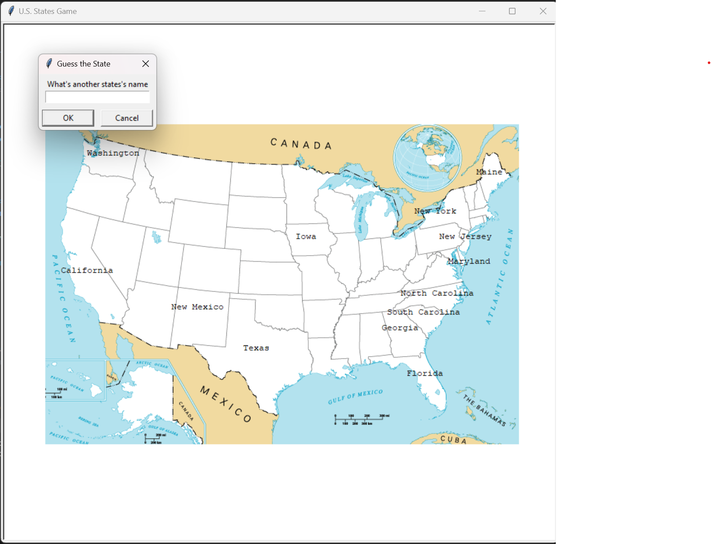

# U.S. States Game

## Overview
The U.S. States Game is an engaging Python application that helps users learn the names and locations of the 50 states in the United States. It's designed with an interactive graphical interface using the `turtle` module, and utilizes `pandas` for data management. The game allows players to guess states and see them appear on a U.S. map, enhancing geographic knowledge in a fun way.

## Features
- Interactive map of the United States.
- Text input for guessing state names.
- Score tracking for correct guesses.
- Limited number of incorrect guesses allowed.
- Option to exit the game by typing 'Exit'.
- Generation of a list of states not guessed for further learning.

## Prerequisites
- Python (version 3.x recommended).
- `pandas` library (Install via `pip install pandas`).
- `turtle` graphics module (usually pre-installed with Python).
- Game resources: `50_states.csv` and `blank_states_img.gif`.

## Installation
1. Ensure Python is installed on your system.
2. Clone or download the game files to a local directory.
3. Place the `50_states.csv` and `blank_states_img.gif` in the same directory as the game script.

## How to Play
1. Run the script in a Python environment (e.g., `python us_states_game.py`).
2. The game window will open with a map of the U.S.
3. Type the name of a state into the prompt and hit enter. If correct, the state name will appear on the map.
4. To exit the game at any time, type 'Exit'.
5. The game ends after 6 wrong guesses or choosing to exit. Your score and a CSV file of unguessed states will be generated.

## Exiting the Game
- Type 'Exit' during your turn to end the game immediately.
- Click on the game window to close it after the game ends.

## Game Resources
- **50_states.csv**: Contains state names and their coordinates on the map.
- **blank_states_img.gif**: A blank map of the U.S. used as the game's background.

## Contributing
Feel free to fork the repository, make changes, and submit pull requests. All contributions are welcome!

## License
This project is open-source. See the LICENSE file for more details.

## Contact
[Your Contact Information]

## Acknowledgements
- Thanks to all who contributed to the development and testing of this educational tool.

